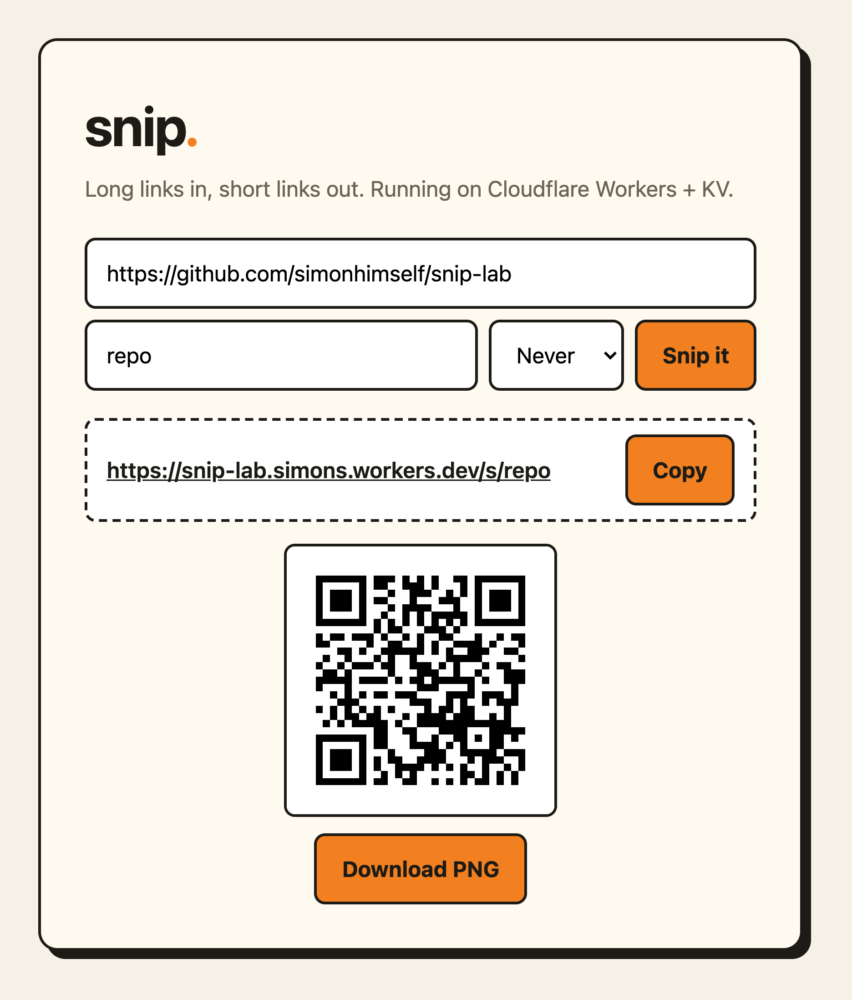
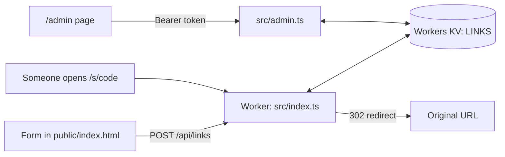

# snip.

**Turn long links into short ones you can share, scan, and track.** A small URL shortener that runs on Cloudflare Workers.

<p align="center">
  
  <br>
  <em>A real link created on the live site.</em>
</p>

**[Try it at snip-lab.simons.workers.dev →](https://snip-lab.simons.workers.dev/)**

## Short links, your way

- **Pick the name.** Use a memorable code like `/s/my-talk`, or let Snip generate one.
- **Share it anywhere.** Every link comes with a QR code you can download as a PNG for slides or posters.
- **Let it expire.** Choose 1 hour, 1 day, or 7 days for temporary links, and see how often each link is clicked.

## How to use it

1. Paste a full link starting with `http://` or `https://` at **[snip-lab.simons.workers.dev](https://snip-lab.simons.workers.dev/)**.
2. Optionally type a custom code (3–32 lowercase letters, numbers, or dashes) and choose when it expires.
3. Select **Snip it**, then **Copy** the short link or **Download PNG** for the QR code.

The owner can open `/admin` with the admin token to see every link with its click count and delete links.

## How it works



The page is a single static HTML file. The Worker only runs for `/api/*` and `/s/*`. Each link is stored in KV as JSON (`url`, `clicks`, `createdAt`, `expiresAt`).

A few decisions keep it simple and safe:

- **Only web links.** `javascript:`, `data:`, and other schemes are rejected so a short link can't run scripts.
- **Expiry uses KV's own TTL.** Cloudflare deletes expired keys, and every write re-applies the original deadline, so counting a click never extends a link's life.
- **Admin token checked in constant time.** Both values are hashed and compared with `crypto.subtle.timingSafeEqual`, so response timing doesn't leak how close a guess is.

| Method | Path | Result |
|---|---|---|
| `POST` | `/api/links` | `{ url, code?, expiresIn? }` → `{ code, shortUrl, expiresAt }` |
| `GET` | `/s/:code` | `302` to the original URL, counts a click |
| `GET` | `/api/links/:code` | `{ code, url, clicks, createdAt, expiresAt }` |
| `GET` | `/api/health` | `{ ok, adminTokenConfigured }` |
| `GET` | `/api/admin/links` | All links (needs `Authorization: Bearer <ADMIN_TOKEN>`) |
| `DELETE` | `/api/admin/links/:code` | Delete a link (needs the token) |

## Run locally

Use a current Node.js LTS release and npm.

```sh
git clone https://github.com/simonhimself/snip-lab.git
cd snip-lab
npm install
cp .dev.vars.example .dev.vars   # local ADMIN_TOKEN for /admin
npm run dev
```

Open http://localhost:8787. Local development uses a simulated KV store, so nothing touches Cloudflare.

Check your changes:

```sh
npm run typecheck                 # TypeScript
scripts/smoke-test.sh             # 5 checks against http://localhost:8787 (pass any URL to test elsewhere)
```

| Script | What it does |
|---|---|
| `npm run dev` | Local dev server |
| `npm run typecheck` | TypeScript check |
| `npm run types` | Regenerate `worker-configuration.d.ts` after changing `wrangler.jsonc` |
| `npm run deploy` | Manual deploy to Cloudflare (normally pushes to `main` deploy automatically) |
| `scripts/smoke-test.sh [BASE_URL]` | Health, create, redirect, validation, and 404 checks |

## Limitations

- **Links need the full address.** `example.com` without `https://` is rejected.
- **Click counts are approximate.** KV isn't atomic, so two clicks at the same moment can count as one.
- **Custom codes can race.** Two people claiming the same new code at the same instant could both succeed; the second wins.
- **No rate limiting or sign-in for creating links.** Anyone with the URL can create short links.
- **Expiry choices are fixed** to Never, 1 hour, 1 day, or 7 days in the form (the API accepts 60 seconds to 1 year).

## Further documentation

- [docs/OPERATIONS.md](docs/OPERATIONS.md): deployment, previews, secrets, and storage.
- [LEARNING.md](LEARNING.md): Snip was built as a hands-on course in OpenChamber, git worktrees, GitHub issues and pull requests, and Cloudflare deploys.
- [AGENTS.md](AGENTS.md): instructions for AI coding agents working in this repo.
